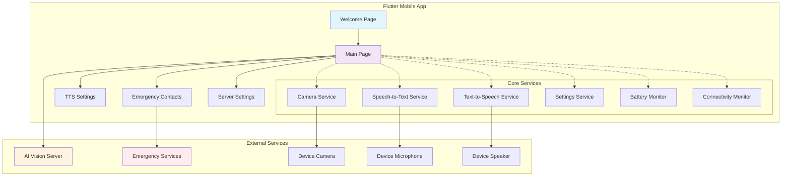
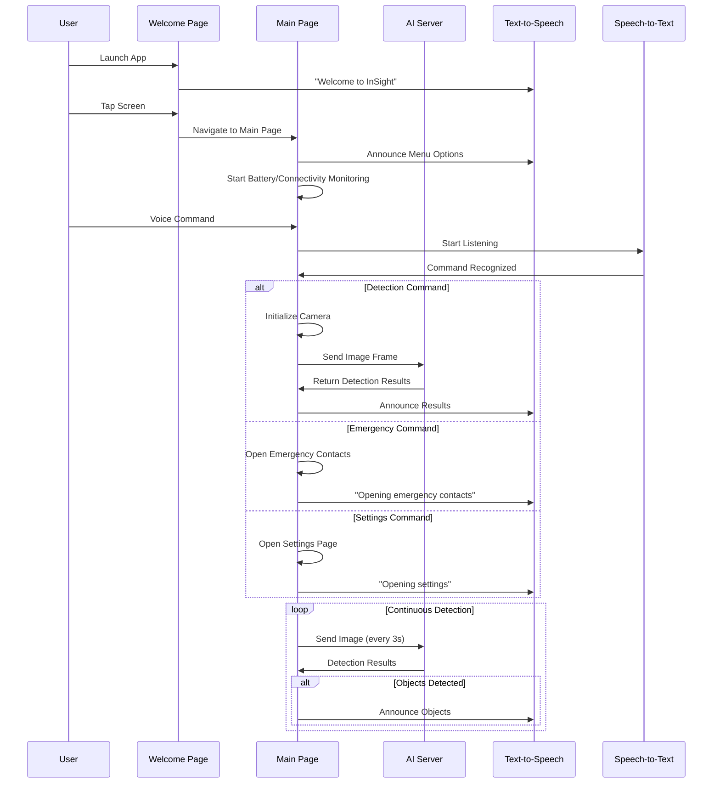
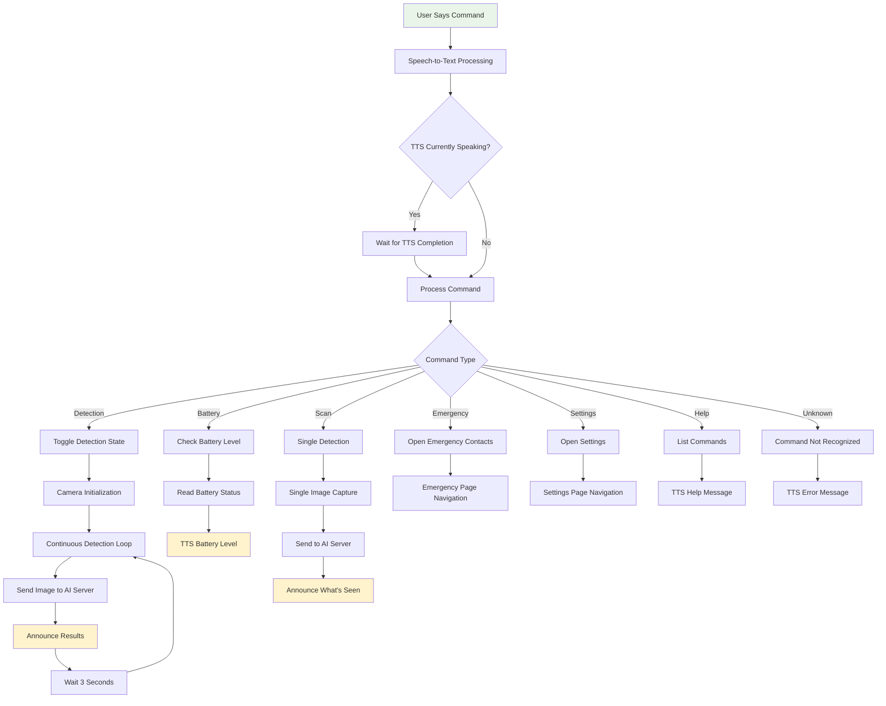
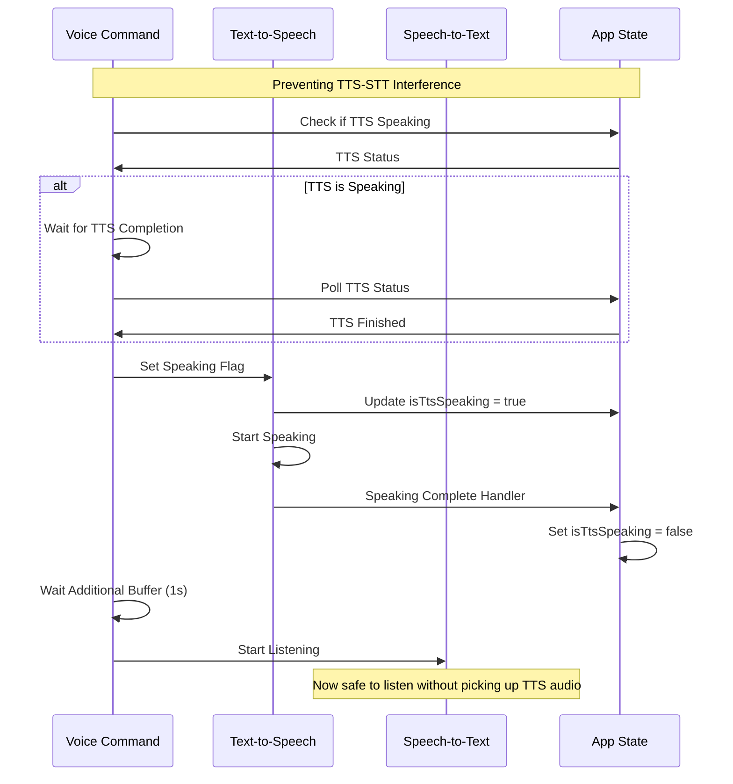

# InSight App - AI-Powered Accessibility Mobile Application

## Overview

InSight is a Flutter-based mobile application designed to provide AI-powered visual assistance for visually impaired users. The app leverages computer vision, text-to-speech (TTS), speech recognition, and real-time object detection to help users navigate and understand their environment through voice commands and audio feedback.

## Features

### 🎯 Core Features

- **Real-time Object Detection**: Continuous camera-based object recognition with server-side AI processing
- **Voice Command Interface**: Comprehensive speech-to-text command processing
- **Text-to-Speech Feedback**: Audio announcements and guidance in multiple languages
- **Emergency Contact System**: Quick access to emergency contacts with one-tap calling
- **Battery & Connectivity Monitoring**: Real-time system status updates
- **Server Configuration**: Customizable AI server endpoints

### 🗣️ Voice Commands

- `"start detection"` / `"begin detection"` - Start continuous object detection
- `"stop detection"` / `"end detection"` - Stop object detection
- `"what do you see"` / `"scan now"` - Perform single environment scan
- `"battery level"` - Check current battery status
- `"emergency"` - Access emergency contacts
- `"settings"` - Open server configuration
- `"help"` - List all available commands

### 📱 Accessibility Features

- High contrast dark theme optimized for low vision users
- Large touch targets for easy navigation
- Comprehensive audio feedback for all interactions
- Screen reader compatibility with semantic labels
- Voice-first interaction design

## Architecture Overview



## Application Flow



## Voice Command Processing Flow



## Object Detection System Architecture

```mermaid
graph LR
    subgraph "Mobile App"
        A[Camera Controller] --> B[Image Capture]
        B --> C[Image Processing]
        C --> D[HTTP Client]
    end

    subgraph "Network"
        D --> E[Multipart Request]
        E --> F[Server Communication]
    end

    subgraph "AI Server"
        F --> G[Image Reception]
        G --> H[AI Model Processing]
        H --> I[Object Detection]
        I --> J[Results Formatting]
        J --> K[JSON Response]
    end

    subgraph "Response Processing"
        K --> L[Parse JSON]
        L --> M[Filter Results]
        M --> N[Text-to-Speech]
        N --> O[Audio Feedback]
    end

    style H fill:#ffeb3b
    style O fill:#4caf50
```



## Emergency System Workflow

```mermaid
flowchart TD
    A[Emergency Trigger] --> B{Emergency Contacts Available?}
    B -->|Yes| C[Load First Contact]
    B -->|No| D[Prompt to Add Contacts]

    C --> E[TTS: "Calling [Contact Name]"]
    E --> F[Launch Phone Dialer]
    F --> G[System Phone Call]

    D --> H[Emergency Contacts Page]
    H --> I[Add Contact Form]
    I --> J[Save Contact to Storage]
    J --> K[TTS Confirmation]

    subgraph "Emergency Page Features"
        L[Emergency Call Button]
        M[Contact List]
        N[Add Contact Dialog]
        O[Delete Contact Option]
    end

    L --> C
    M --> P[Tap to Call]
    P --> E
    N --> I
    O --> Q[Remove from Storage]

    style A fill:#ffcdd2
    style G fill:#c8e6c9
    style F fill:#fff9c4
```

## Battery & Connectivity Monitoring

```mermaid
graph TD
    A[App Initialization] --> B[Start Battery Timer]
    A --> C[Start Connectivity Timer]

    B --> D[Check Battery Level Every 1s]
    C --> E[Check Connection Every 30s]

    D --> F{Battery State Changed?}
    F -->|Yes| G[Update UI & TTS]
    F -->|No| H[Continue Monitoring]

    E --> I{Connection Changed?}
    I -->|Yes| J[Update Status & TTS]
    I -->|No| K[Continue Monitoring]

    G --> L{Battery Events}
    L -->|Full| M[TTS: "Battery is full"]
    L -->|Charging| N[TTS: "Device is charging"]
    L -->|Low| O[TTS: "Low battery warning"]

    J --> P{Connection Types}
    P -->|WiFi| Q[TTS: "Connected to WiFi"]
    P -->|Mobile| R[TTS: "Connected to mobile data"]
    P -->|None| S[TTS: "No internet connection"]

    H --> D
    K --> E
    M --> H
    N --> H
    O --> H
    Q --> K
    R --> K
    S --> K
```

## TTS Synchronization System



## Project Structure

```
insight/
├── lib/
│   ├── main.dart                 # App entry point and routing
│   ├── insideApp/
│   │   └── welcome_page.dart     # Initial welcome screen
│   ├── main_page/
│   │   └── main_page.dart        # Primary app interface
│   └── system/
│       ├── emergency.dart        # Emergency page implementation
│       ├── emergency_contacts_page.dart  # Emergency contacts management
│       ├── mqtt_service.dart     # MQTT service (placeholder)
│       ├── server_settings_page.dart    # AI server configuration
│       ├── settings_service.dart # Settings persistence service
│       └── tts_settings_page.dart       # TTS configuration
├── android/                      # Android-specific configuration
├── ios/                         # iOS-specific configuration
├── assets/                      # App assets and resources
└── pubspec.yaml                 # Flutter dependencies
```

## Dependencies

### Core Flutter Packages

- **flutter_tts**: Text-to-speech functionality
- **speech_to_text**: Speech recognition and voice commands
- **camera**: Camera access for image capture
- **battery_plus**: Battery level monitoring
- **connectivity_plus**: Network connectivity status

### Utility Packages

- **http**: HTTP client for server communication
- **shared_preferences**: Local data persistence
- **permission_handler**: Runtime permission management
- **url_launcher**: External app launching (calls, SMS)
- **path_provider**: File system path access
- **flutter_sound**: Audio recording and playback

### AI & Processing

- **porcupine_flutter**: Wake word detection (configured)

## Setup Instructions

### Prerequisites

- Flutter SDK (>=3.8.1)
- Android Studio / Xcode for mobile deployment
- AI Vision Server (custom implementation required)

### Installation

1. Clone the repository
2. Install dependencies:
   ```bash
   flutter pub get
   ```
3. Configure your AI server endpoint in `lib/system/settings_service.dart`
4. Run the application:
   ```bash
   flutter run
   ```

### Server Configuration

The app requires an external AI vision server that accepts image uploads and returns object detection results. Configure the server URL in:

- **Settings Service**: `lib/system/settings_service.dart`
- **Runtime**: Through the app's server settings page

Expected server API:

- **Endpoint**: POST request with multipart/form-data
- **Input**: Image file
- **Output**: JSON with detection results

## Usage Guide

### First Launch

1. App opens to welcome screen with TTS greeting
2. Tap anywhere to proceed to main page
3. Main page announces available options and system status

### Voice Commands

1. Say "Voice Command" or tap the voice button
2. Wait for the listening prompt
3. Speak your command clearly
4. App processes and responds with TTS feedback

### Object Detection

1. Say "start detection" or use voice command
2. Point camera at objects you want to identify
3. App captures images every 3 seconds
4. Detected objects are announced via TTS
5. Say "stop detection" to end

### Emergency Features

1. Say "emergency" to access emergency contacts
2. First contact is called immediately if available
3. Add contacts through the emergency page
4. Tap contacts to call directly

## Accessibility Features

### Visual Accessibility

- High contrast dark theme
- Large, clear typography
- Semantic labels for screen readers
- Intuitive touch targets

### Audio Accessibility

- Comprehensive TTS feedback
- Voice-first navigation
- Audio status updates
- Spoken error messages

### Motor Accessibility

- Large touch areas
- Voice control for all features
- Simple gesture requirements
- Tap-anywhere navigation on welcome screen

## Voice Command

The app includes comprehensive voice command timeout and interference fixes:

### Timeout Enhancements

- **Extended Listening**: Up to 2 minutes per command
- **Pause Tolerance**: 5-second pause allowance
- **Retry Mechanism**: Automatic retry on failures (up to 3 attempts)
- **Better Recognition**: Dictation mode for improved accuracy

### TTS Interference Prevention

- **State Tracking**: Monitors when TTS is speaking
- **Synchronization**: Waits for TTS completion before listening
- **Session Management**: Reduces redundant announcements
- **Buffer Time**: Additional delay to prevent audio echo pickup

## Error Handling

### Graceful Degradation

- Network failures are handled with retry mechanisms
- Camera errors don't crash the app
- TTS failures fall back to UI feedback
- Voice command errors provide helpful guidance

### User Feedback

- Clear error messages via TTS
- Status updates for all operations
- Connection health checks before detection
- Battery and connectivity warnings

## Future Enhancements

### Planned Features

- MQTT integration for IoT device control
- Advanced wake word detection
- Multi-language support expansion
- Offline object detection capabilities
- Cloud backup for emergency contacts

### Performance Optimizations

- Image compression for faster server communication
- Caching mechanisms for frequent responses
- Battery optimization for continuous detection
- Network usage optimization

**InSight App** - Empowering independence through AI-powered accessibility technology.
